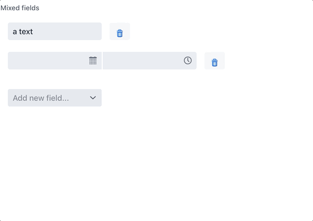

= Multi field

Vaadin java implementation of a set of fields.

== Development instructions

Simple use case
[source,java]
----
include::src/test/java/com/vaadin/addons/flow/components/MultiFieldDemo.java[lines = 30..30]
----

Advanced use case
[source,java]
----
include::src/test/java/com/vaadin/addons/flow/components/MultiFieldDemo.java[lines = 40..66]
----
